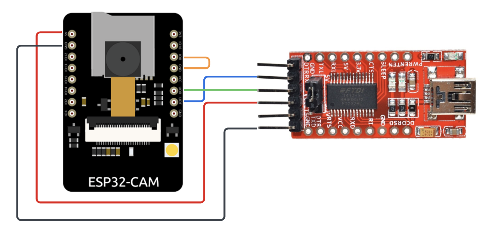

# Automatic Pet Feeder With ESP32-CAM & Yolov8 Object Detection🐾

## Description
This project combines an ESP32-CAM and a servo motor to create an automatic pet feeder. It includes a Flask-based frontend web application for controlling the device and streaming the camera view. A YOLOv8 object detection model is used to recognise pets, while OpenCV is used to process and display the images and layered detection information. This smart IoT device is a CS50 final project.

## Video Demo

## Table of Contents

- [Features](#features)
- [Wiring Diagrams](#wiring-diagrams)
- [Getting Started](#getting-started)
  - [Prerequisites](#prerequisites)
- [Installation](#installation)
- [Usage](#usage)
- [File Structure](#file-structure)
- [References](#references)
- [License](#license)
- [Acknowledgements](#acknowledgements)

## Features

- Remote pet feeding controlled via a web interface.
- Live streaming and monitoring from camera.
- Automatic feeding using object detection.
- Adjustable timer between feeds.
- Detection of dogs, cats, or birds.
- Adjustable food portion size.

## Wiring Diagrams

### Camera and Servo Circuit

### Serial Converter Connection for Programming

## Getting Started

### Prerequisites

#### Hardware

- ESP32-CAM microcontroller board.
- ESP32-CAM MB or FTDI USB to serial converter for programming microcontroller.
- Digital servo motor.

#### Software
- Python 3.9.18
- Anaconda
- Arduino IDE

### Installation

1. Clone the repository:  
`git clone https://github.com/PierceBrandies/PetFeeder.git`  
`cd PetFeeder`

2. Install dependencies:  
To create a new conda environment and install all dependencies run this command:  
`conda create --name pet-feeder --file requirements.txt`  

3. Verify package installation:  
Activate conda environment using `conda activate pet-feeder`, and list packages using `conda list`, to verify with **requirements.txt** file that all packages and versions are the same.

4. Add ESP32 boards to Arduino IDE boards manager:  
Open Arduino IDE
Navigate to settings
In Additional boards manager URL's paste this URL:
`https://raw.githubusercontent.com/espressif/arduino-esp32/gh-pages/package_esp32_index.json`

5. Upload code to ESP32-CAM:  
Connect CAM to your machine using either the ESP32-CAM MB or FTDI serial converter (See wiring diagrams).  
Open ESP_Cam_Servo.ino file in Arduino IDE.
Select either **ESP32 Wrover Module** or **AI Thinker ESP32-CAM** Under Tools > Board > ESP32.  
Select your COM Port under Tools > Port.  
Press Upload.

6. Connecting to ESP32 using WiFi Access point:  
Once code has been uploaded and ESP32-CAM is powered on it is time to connect it to your WiFi network.  
On any device open WiFi settings and connect to 'Pet Feeder Cam'.  
A local host will appear where you can select the network you want to connect the ESP32-CAM to by selecting the network SSID then inputting the network password (only 2.4GHz networks are supported by ESP32 chip).

7. Configuring CAM IP address:  
Once the CAM has been connected to your WiFi network, open the serial monitor in the Arduino IDE to find the IP address the CAM has been given.
Set CAM IP address in **helpers.py** (line 10) making sure to add a colon followed by the port number to the end of the IP address. Default port is 8080 but this may need to be changed in **ESP_Cam_Servo.ino** depending on network setup.  
**Example:**  
`# Set Cam IP address`  
`cam_ip = '192.168.50.36:8080'`

8. Test Connection and Communication:  
Communication to ESP32-CAM can be tested using **comsTest.py** by giving CAM IP address and port number to `cam_ip` variable and running script.

## Usage
- Run app.py and connect to local host using browser
- Select Camera to see live view from ESP32-CAM
- Toggle flash on/off
- Select feed to manually feed pet
- Select settings to set up parameters for feed amount and all auto_feeding/object detection settings
- Remember to turn on auto feed using the toggle at the bottom of settings page to enable feeding from object detection.

## File Structure
- **ESPModulesCode**: Directory for ESP32 code.
  - **ESP32_Cam_Servo.ino**: Arduino sketch containing the code to program ESP32-CAM.

- **Flask**: Main directory containing all Flask related files and folders.
  - **app.py**: The main Python script that runs the Flask application.
  - **comsTest.py**: Python file containing test for ESP32-CAM connection to WiFi and communication to python.
  - **helpers.py**: Python file containing functions for use in app.py.
  - **templates**: Directory containing HTML templates.
    - **index.html**: The homepage template.
    - **layout.html**: The layout template that all other templates borrow from for HTML structure.
    - **settings.html**: The settings page template.
    - **stream.html**: The live cam video stream template.
  - **static**: Directory containing static files such as CSS and JavaScript.
    - **images**: Image folder for images used in flask app.
      - **CS50_Duck.png**: CS50 Duck logo for home page.
      - **icon-logo.png**: Head shortcut icon.
      - **logo.png**: Homepage logo.
    - **styles.css**: CSS styles for the application.

- **Images**: Directory for storing images for README.md
  - **cam-ftdi-diagram**: Wiring diagram for connecting FTDI USB to serial converter to ESP32-CAM.
  - **cam-servo-diagram**: Wiring diagram for connecting ESP32-CAM and servo motor.

- **README.md**: Readme markdown file.

- **yolov8n.pt**: Yolov8 nano object training model.

- **requirements.txt**: File containing a list of dependencies for the project.
  - Used with anaconda to install required Python packages.

## References
- **Tutorials on Yolov8 and openCV**: https://www.youtube.com/@ComputerVisionEngineer
- **Official ESP-32 Cam Github**: https://github.com/espressif/esp32-camera
- **ESP32-CAM Guide**: https://www.youtube.com/watch?v=visj0KE5VtY&t=511s
- **ESP32-CAM code reference**: https://www.electroniclinic.com/esp32-cam-with-python-opencv-yolo-v3-for-object-detection-and-identification/

## License
This project is licensed under the MIT License - see the [LICENSE](LICENSE) file for details.

## Acknowledgements
I would like to acknowledge the following for their contributions to this project:

- **Parice Brandies**: For supplying me with an Arduino starter kit that started the journey into hardware and electronics. Also for being the best older sister I could have.
- **Chelsea Grima**: For being the muse for this project as I knew how Binnie being detected and fed would make you laugh.
- **Winston 'Binnie' Grima (dog)**: For being the object detetction test subject as well as the talent in the projects demonstration video.
- **David Malan & entire CS50 staff**: For creating and running a truly exciting and deeply inspiring course. As well as greatly upholding and contributing to the culture of programming and computer science/technologies.
